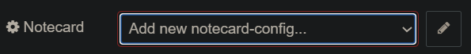
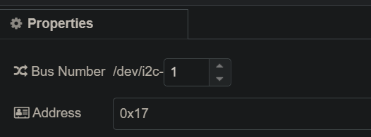
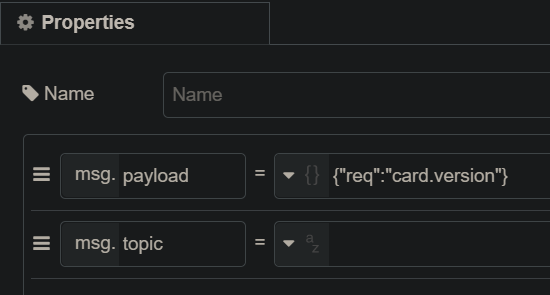
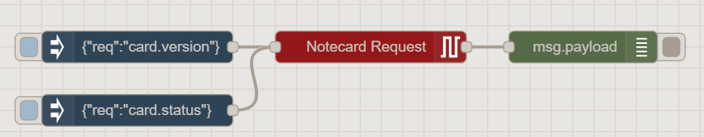

# note-nodered

Node JS library with Custom Node Red package for communication with Blues Wireless Notecard over I²C or Serial (UART) connections.

This Node Red package enables you to control the Notecard by developing flows in Node Red where a server is connected to the Notecard. For I²C connections, a Raspberry Pi or similar host is required.

## Installation

### Add Notecard Package
With Node Red pallet manager search for `node-red-contrib-notecard`

For manual installation, follow the steps suggested by the following video:
  https://youtu.be/2bmWBU2xnHc

You can access the source in the repo here:
  https://github.com/blues/note-nodered 

### Enable I2C or Serial on Raspberry Pi
The I2C interface on the Raspberry Pi must be enabled if using a [Notecarrier-PI Hat](https://shop.blues.io/products/carr-pi)

The serial interface on the Raspberry Pi must be enabled if using a [Notecarrier-A*](https://shop.blues.io/collections/notecarrier) or [Notecarrier-B](https://shop.blues.io/collections/notecarrier/products/carr-b).

Assuming you are using a Raspbian-based operating system distribution on the Raspberry Pi:
 - [I2C configuration](https://dev.blues.io/build/tutorials/sensor-tutorial/notecarrier-pi/raspberry-pi/python/#configure-the)

 - [Serial configuration](https://dev.blues.io/build/tutorials/sensor-tutorial/notecarrier-al/raspberry-pi/python/#configure-serial-between-and)


## Usage

Add a `Notecard Request` node to a Node Red flow from the node pallet on the left-hand side of the interface.

Populate input message `payload` field with a JSON object conforming to a [Notecard request](https://dev.blues.io/reference/complete-api-reference/introduction/).

The Notecard response will appear in the `payload` field of the output as a JSON object.

### Configuration
The `Notecard Request` node must select a `Notecard` configuration node.

If there is no configuration node available, select `Add new notecard-config`, and click the edit button.



#### Configuration Node Settings
The default Notecard Configuration node settings support the default Raspberry Pi and Notecard configurations.
In most cases, additional configuration is not required.

__Connection__
Select the connection type used to communicate with Notecard.  When using the Notecarrier-Pi, make sure `I2C` is selected.  If using a USB port, select `serial`.

__Bus Number__
The I2C bus number must be set to the port number being used by the I2C module on the Raspberry Pi.  It is a value between [0, 7] inclusive.

__Address__
The default address for the Notecard is 0x17 (23).  If that has been changed, then set the address value to the new Notecard address.


__Port__ 
Serial port which Notecard is connected to when using `serial` communication option.

__Baud Rate__
The baud rate in bits-per-second used to communicate with Notecard over serial. Use 115200 only if using the [Auxiliary Serial Port](https://discuss.blues.io/t/what-is-aux-rx-tx-and-how-do-i-use-it/153).

### Sending Notecard Requests
The `Notecard Request` node accepts Notecard requests formed as JSON object.

Set the value of the input  `msg.payload` to a Notecard request.

Here is an example using an `Inject` node:



__Response__

The `Notecard Request` will output the response from the Notecard in the `msg.payload` field as a JSON object.

```json
{
    "_msgid":"ece314b1.2b8478",
    "payload":{
        "body":{
            "org":"Blues Wireless",
            "product":"Notecard",
            "version":"notecard-1.5.2",
            "ver_major":1,
            "ver_minor":5,
            "ver_patch":2,
            "ver_build":12200,
            "built":"Dec  7 2020 19:28:29"
        },
        "version":"notecard-1.5.2.12200",
        "device":"dev:xxxxxxxxxxxxxxx",
        "name":"Blues Wireless Notecard",
        "type":11,
        "sku":"NOTE-NBNA500"
    },
    "topic":""
}
```

## Examples
The [examples](examples/) directory contains example Node Red flows:

- [Get Notecard Version](examples/notecard-version-request.json)


#### Simple Flow Example Layout


## Compatibility
Version 1.x.x is not backwards compatible with version 0.x.x.  There is no expectation of support for importing flows developed with previous versions of this package.

Version 1.x.x does *not* support JSON strings as request inputs or response outputs.  All requests and responses are formatted as a JSON object.

### Migration
`Notecard Request` nodes are a drop in replacement in the diagram if using JSON objects for input and output.  

Be sure to set the Notecard Config node in each case.  

Any JSON string inputs need to be parsed to JSON objects prior to input into this node.

## Contributing

We love issues, fixes, and pull requests from everyone. By participating in this project, you agree to abide by the Blues Inc [code of conduct](https://blues.github.io/opensource/code-of-conduct).

For details on contributions we accept and the process for contributing, see our [contribution guide](CONTRIBUTING.md).

## Running the Tests

If you're planning to contribute to this repo, please be sure to run the tests before submitting a PR. 

Tests can only be run on Raspberry Pi connected to Notecard over I2C

Navigate to the root folder and execute

```bash
npm test
```

## More Information

For additional Notecard SDKs and Libraries, see:

* [note-python](https://github.com/blues/note-python) for Python support
* [note-c](https://github.com/blues/note-c) for Standard C support
* [note-go](https://github.com/blues/note-go) for Go
* [note-arduino](https://github.com/blues/note-arduino) for Arduino 

## To learn more about Blues Wireless, the Notecard and Notehub, see:

* [blues.com](https://blues.com)
* [notehub.io][Notehub]
* [wireless.dev](https://wireless.dev)

## License

Copyright (c) 2021 Blues Inc. Released under the MIT license. See [LICENSE](LICENSE) for details.

[code of conduct]: https://blues.github.io/opensource/code-of-conduct
[Notehub]: https://notehub.io
